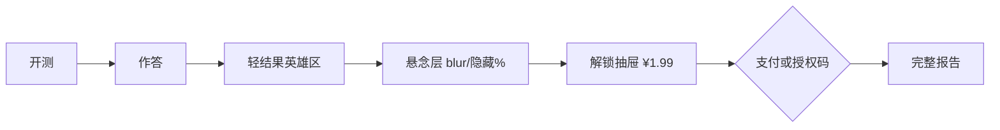

# 心象测 · 视觉 / 交互 / 系统设计审计稿（Cursor 对照版）

**审计日期**: 2026-08-11  
**审计角色**: 移动端产品设计总监 + 交互视觉顾问  
**线上证据**: https://monitor.xhs365.cn/（375–428 视口截图 + DOM）  
**代码根**: `D:\选品报告\资料生产工厂\digit-hub\`  
**约束遵守**: 不改计分；不引入 React/Vue；建议可静态落地  

> 本稿用于与 GLM / 其他模型的同题审计对照。重点是**可执行的改法**，不是泛泛夸奖。

---

## A. 视觉诊断（三句话定调）

1. **现在像什么**：像一本排版讲究的「实验室纪要 App」——纸色、印章绿、陶土序号都对，首屏品牌字有仪式感，但能量偏低，像「高级说明书」多于「想立刻测完并发朋友圈」。
2. **应该像什么**：仍是墨纸实验室，但首屏应有**一张主推卡的视觉重力**（今日唯一答案），测题页有里程碑节奏，轻结果像「拆盲盒半开」，解锁抽屉像「限时实验协议」而非普通收银台。
3. **最大差距**：品牌气质已立住，**焦点层级与转化仪式感不足**——19 张横滑卡同权、目录偏后台清单、支付抽屉缺心理锚点；Tone 三风格在 UI token 上有差异，但用户感知仍偏「换文案」而非「换体验」。

---

## B. 按页面的冲击力清单

| 页面 | 现状问题 | 改法（具体到 CSS / copy） | 预期效果 | 工时 |
|------|----------|---------------------------|----------|------|
| 首页 Hero | 品牌字+双 CTA 清晰，但下方立刻被 19 卡横滑稀释；「今日测评」与「今日测评卡」语义打架 | `pages.js` renderHome：Hero 下只放 **1 张 featured 主推卡**（大号，含 seal 色条+分钟+1 行 promise），横滑改名为「更多测评」且只露出 4–6 张 + more | 首屏焦点单一，转化更像「今日实验」 | S |
| 首页 rail | `.rail-card` 同款灰底卡片，01/02/03 仅靠 ember 序号区分，无皮主题色/图标 | `app.css`：为前 3 皮加 `data-skin` 色条（七宗罪墨红、MBTI 墨绿、心理年龄陶土）；card `min-height` 提高，promise 限制 2 行 | 横滑可扫读、有集邮欲 | S |
| 首页 A2HS | 「添加到主屏幕」浮层压在 rail 上，抢 CTA | `a2hs`：首访延迟到滚过 Hero 后再出；或缩成顶栏次级入口 | 不打断开测 | XS |
| #/tests | 标题下「复购剧本」文案像内部黑话；每项「展开简介」二次点击成本高 | `pages.js` renderCatalog：副标题改「按场景选一张」；简介默认露出一行 promise，accordion 改「更多」 | 目录更像产品，不像后台 | S |
| intro | Tone 切换有，但预览区冲击弱 | intro 选 Tone 时即时切换 `data-tone` + 一句话 claim（来自 tones/*.json `claim`）大字展示 | 用户感到「选风格=选体验」 | S |
| play | 进度仅 X/Y + 条，无 25/50/75 仪式；选项反馈有，但无「答完一截」的奖励 | `session.js` / play 渲染：在 25%/50%/75% 插一行里程碑 copy（不改分）；进度条加 milestone tick | 降低中段流失 | S |
| softResult | 英雄类型有力；下方 value 区信息密，解锁 CTA 埋得偏下 | 解锁条 `position: sticky; bottom: calc(12px + var(--safe-b))`；英雄区下立刻放 ¥1.99 主 CTA，价值清单可折叠 | 拇指可达转化点 | S |
| 解锁抽屉 | 仅「¥1.99」，无锚价；渠道按钮与套餐同级，视觉平 | 套餐行加 `<s class="muted">¥9.9</s> → ¥1.99`；渠道改小 pill；主 CTA 仍是套餐按钮 | 价格感知↑ | XS |
| 分享卡 | 有 3:4 卡与金句，但页内「截图这句话」与「导出」双路径略散 | 轻结果英雄区只留 **一个** 主分享动作（导出卡），截图提示改为次文案 | 传播动作清晰 | XS |

**验收方式（通用）**：375 宽截图对比「改前/改后」——首屏是否只剩 1 个主焦点；支付抽屉是否能在 2 秒内读出价格锚点。

---

## C. 题目与内容设计

### C.1 Tone 差异度（代码事实）

- `seven_sins.json` 等皮已有 `voice.rigorous / humor / funny` 三套题干与选项文案 ✅
- `packages/tones/rigorous.json` 等提供 token + result chrome copy（`softHead`/`unlockTitle`）✅
- 注意：tones 目录里搞笑 id 为 **`comedy`**，题目 voice 键多为 **`funny`**——实现层需确认映射，否则「搞笑」可能只换了 UI token、题干仍落默认

### C.2 改写样例（seven_sins 风格，不改计分点）

| 场景 | Before（严谨倾向） | After（幽默，同选项分值） | 说明 |
|------|-------------------|---------------------------|------|
| 钩子题（建议第 1–2 题） | 「团队成功时，你更在意？」 | 「庆功宴上你第一反应是：盯着谁没出力 / 盘菜单 / 想散场」 | 场景化，降低「量表感」 |
| 中段疲劳题 | 抽象价值排序 | 加具体微场景（地铁/微信群/发工资日） | 防第 12–18 题流失 |
| funny Tone | 若只换俏皮词 | 选项也要梗感对称（四选都「好笑且可自评」） | Tone 差异要「可感知」 |

**建议**：每皮指定 **Q1 为钩子题**（已偏场景的留下，偏抽象的前移）；`love_brain` 等迁入皮检查是否真有三 Tone voice，若只有一套文案，先标「Tone UI-only」避免过度承诺。

**验收**：同一皮切 rigorous ↔ funny，截题干+选项对比，外行 3 秒能说出「语气变了」。

---

## D. 目录与多测评抽屉 IA

### 现状

```
首页 Hero
  └ 横滑 18 live + more（同权）
#/tests
  └ 六组 accordion：性格 / 情感 / 职场 / 周期 / 双人 / 趣味
```

### 问题

1. 首页横滑 **信息过载**（rail=19），「今日」失焦  
2. 目录副文案「复购剧本」对 C 端无意义  
3. 缺 **时长筛选**（5 分钟以内）与 **热门/新品** 信号  
4. `lane-pill`（如情感引流）偏运营内部词，可对用户改成「关系向」

### 建议线框（文字）

```
首页
┌─────────────────────┐
│ INK PAPER LAB       │
│ 心象测               │
│ 三分钟，看见另一种自己 │
│ [开始今日测评]       │
├─────────────────────┤
│ 今日主推（大卡）      │
│ 七宗罪 · 5分钟 · 承诺 │
│ [进入实验]           │
├─────────────────────┤
│ 更多测评 →→→（4–6卡） │
└─────────────────────┘

#/tests
┌─────────────────────┐
│ 全部测评             │
│ [≤5分钟] [情感] [职场]│  ← chip 筛选，前端 filter 即可
│ 性格认知             │
│  · 七宗罪  5′  承诺… │
│  · MBTI   12′ …     │
└─────────────────────┘
```

**改法落点**：`catalog.json` 不改分组 id；`pages.js` renderCatalog 加 chip；首页 featured 单卡结构。

**验收**：新用户从首页到开测点击次数 ≤2；目录页 5 秒内能找到「短测评」。

---

## E. 移动端专项（375px）

| 问题 | 375 证据 | 改法 | 触控/无障碍 |
|------|----------|------|-------------|
| 顶栏「装到桌面/激活/会员·码」三链挤右上 | 截图可见字号偏小、热区挤 | 次要入口收进「···」或账号页；顶栏只留品牌+一个入口 | 热区 ≥44px |
| A2HS 卡压 rail | 首屏中部被占 | 延迟出现 / 可关闭后 7 天不再出 | — |
| 解锁 CTA 在长结果页底部 | 需长滚 | sticky bottom bar + safe-area | `padding-bottom: var(--safe-b)` |
| 支付抽屉与退出抽屉同为 `.drawer` | 层级依赖 open class | 明确 z-index：backdrop 40 / drawer 50；打开时 `body { overflow:hidden }` | 防底层滚动穿透 |
| 选项已 ≥52px | 代码 `.option min-height:52px` | 保持；里程碑文案勿挤占选项区 | WCAG 触控 ✅ |
| 横滑 rail | 有 drag helper | 加左缘 fade 暗示「可滑」；显示滚动条短暂闪现 | 可发现性 |

**验收**：真机 iOS Safari 走完测题→解锁，无滚动穿透；CTA 无需双手操作。

---

## F. 转化漏斗视觉优化



| 步骤 | 心理机制 | 建议 |
|------|----------|------|
| 轻结果英雄 | 身份认同 | 保持大字类型+金句；**避免**在英雄区堆 %（已做对） |
| 悬念 | 蔡格尼克未完成感 | 场景卡保留「完整解读待解锁」；可加一条假进度「报告生成 70% · 解锁后显示结构图」纯文案（不伪数据造假数值） |
| 价值清单 | 理由清单 | 5 条 checklist 可默认折成 3+「展开」 |
| 抽屉价格 | 锚点 | `¥9.9` 划线 → `¥1.99`；副文「7 天 · 1 份报告」 |
| 双路径 | 降低选择瘫痪 | 视觉上：**扫码主路径**大，**授权码**收进「已有购买码？」折叠 |
| 注册表单 | 最后一米 | 已 inline 表单 ✅；可加「仅用于找回报告」信任一句 |

**验收**：漏斗页录屏——从出结果到看见价格锚点 ≤3 秒；发卡用户走授权码不超过 2 点。

---

## G. 优先级路线图

### 本周可上线（纯 CSS/copy，不动计分）

| # | 项 | 工时 |
|---|----|------|
| 1 | 首页 featured 单主推卡 + rail 改「更多」 | S |
| 2 | 解锁 sticky CTA + 抽屉划线价 | XS–S |
| 3 | 目录副文案去黑话 + promise 默认露出 | XS |
| 4 | A2HS 延迟/降噪 | XS |

### 两周（结构调整）

| # | 项 | 工时 |
|---|----|------|
| 5 | play 进度里程碑 25/50/75 | S |
| 6 | #/tests 时长 chip 筛选 | S |
| 7 | Tone claim 大字预览 + funny/comedy 映射核对 | S |
| 8 | 授权码折叠进次级 | XS |

### 需内容生产

| # | 项 |
|---|----|
| 9 | 迁入皮补齐 humor/funny voice（尤其 love_brain 等） |
| 10 | 每皮 Q1 钩子题内容评审 |
| 11 | 分享卡视觉模板按皮主题微差（色条/印章） |

---

## H. 三个「惊艳但克制」的创意

### 1. 「实验室印章」解锁瞬间
支付/授权码成功后，完整报告标题旁盖一枚 CSS 印章动画（seal 绿，旋转 8° 淡入），文案「实验协议已生效」。  
**实现**：`app.css` `@keyframes stamp` + 报告页 class；**风险**：动效需尊重 `prefers-reduced-motion`。

### 2. 「墨迹进度」里程碑
进度条不用荧光粒子，而用墨滴在纸纹上缓慢渗透到 25/50/75。  
**实现**：`progress-track` 伪元素；**风险**：实现过重则退化成普通 tick，勿上粒子库。

### 3. 「今日一签」主推卡
首页主推卡每日轮换（本地日期 hash 选皮），角标「今日实验」。  
**实现**：`renderHome` 按 `Date` 选 featured；**风险**：与运营「固定主推七宗罪」冲突时，加 `catalog.featuredId` 覆盖即可。

---

## 附录：证据摘要

| 证据 | 来源 |
|------|------|
| 首页 kicker / 品牌字 / claim / rail=19 | 线上 DOM 2026-08-11 |
| soft 结果隐藏 %、场景 tease、UNLOCK 五条 | `result/value.js` |
| exit 三按钮挽回 | `quiz/session.js` |
| Tone token + copy | `packages/tones/*.json` |
| 题 voice 三键 | `packages/skins/seven_sins.json` |
| 色板 | `tokens.css`：paper `#f3ede3` seal `#1f6b5c` ember `#c45c26` |

---

## 对照评分维度（用来比其他模型稿）

给另一份审计打分时，用下表（每项 1–5，满分 40）：

| 维度 | 问什么 |
|------|--------|
| 品牌贴合 | 是否守住墨纸，而非套通用「AI 紫渐变」方案 |
| 证据密度 | 是否引用真实文件/线上 DOM，而非空谈 |
| 可执行性 | 是否写到 class/文案/工时，前端能否直接排期 |
| 转化相关 | 是否打到 ¥1.99 漏斗，而非只谈「更好看」 |
| 题目层 | 是否区分计分不可改 vs copy 可改，并给 Before/After |
| 移动端 | 是否谈 sticky CTA、safe-area、热区、滚动穿透 |
| 克制创意 | H 节是否「惊艳但可 CSS 实现」 |
| 路线图 | 是否本周/两周/内容生产分层清晰 |

**本稿自评锚点**：证据与可执行性偏强；未做全皮 Tone 文案抽检（love_brain 等迁入皮需补一轮内容审计）。

---

*Cursor 对照审计稿 · 可与 GLM_DESIGN_UX_PROMPT.md 同题比稿*
